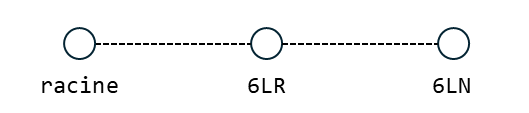
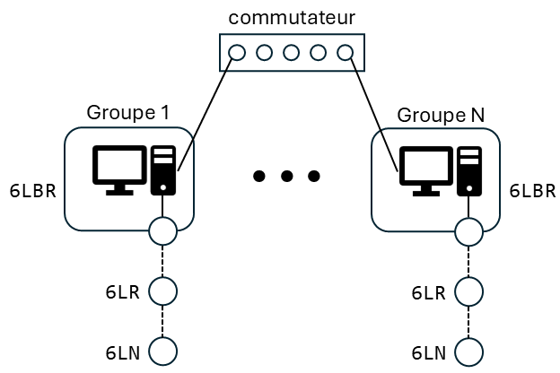

# Internet des objets

## TP 3 Protocole de routage RPL

Dans ce TP, vous allez deployer le protocole de routage RPL sur les cartes nRF52840 DK.
N'hésitez pas à consulter la [documentation de RPL dans Contiki-ng](https://docs.contiki-ng.org/en/develop/doc/programming/RPL.html).

### Objectifs pédagogiques :
- Mettre en place un réseau RPL pour construire un réseau local pour des dispositifs IoT contraints sans fil.
- Comprendre la différence entre les modes _Storing_ et _Non-storing_ de RPL.
- Connecter le réseau local RPL à un réseau externe à l'aide d'un routeur de bordure (6LBR).

Important : Ce travail pratique doit être réalisé en binôme avec 4 cartes par groupe.

### Rendu

Vous devrez rendre, sur moodle, une archive (format .tgz) comportant :
- un rapport au format PDF comprenant les noms de chaque groupe répondant à toutes les questions des exercices et numérotées dans le même ordre ;
- les traces demandées au format PCAP épurées de tout trafic superflu ;
- les fichiers source et de configuration organisés dans un dossier unique pour chaque exercice. Chaque dossier doit inclure : `Makefile`, `project-conf.h`, `receiver-6lr.c`, `sender-6ln.c`, et `root.c`.

Il n'y a qu'un rendu par groupe.
La date limite de rendu est fixée au XXX

## 1. Mode non-storing

Vous devez déployer un réseau RPL en mode _non-storing_ composé d'une racine, d'un routeur (6LR) et d'une feuille (6LN).
La topologie finale souhaitée est illustrée sur la figure ci-dessous.
La 4e carte sera utilisée pour capturer et analyser le trafic réseau à l'aide du programme `sensniff` utilisé dans les précédents TP.



Pour forcer une topologie, il est possible de préciser l'adresse IPv6 du parent souhaité (tous les DIO non émis par ce nœud seront jetés silencieusement).
Pour ce faire, ajoutez la ligne suivante dans le fichier `project-conf.h` (à faire uniquement pour le 6LN) :

```c
#define RPL_CONF_CONN_TO "adresse IPv6 lien-local du parent souhaité"
```

Vous devez établir une connexion UDP entre le 6LN (la source) et le 6LR (la destination).
L'émetteur doit envoyer un message au récepteur lorsque le bouton 1 est pressé.
Les messages transmis doivent comporter :
- un numéro de séquence (sur 1 octet)
- la valeur brute du capteur de température
- un message texte

Le récepteur doit afficher tous les messages reçus.
Tous les affichages demandés devront être réalisés par le système de LOG de contiki-ng.
Le niveau devra être configurable via le fichier `project-conf.h`.

Contiki-ng peut fournir une interface en ligne de commande (CLI) pour directement interragir avec les nœuds via le port série.
Pour ajouter cette fonctionnalité, il faut inclure le module *shell* dans le `Makefile`.
Les commandes principales sont indiquées dans l'aide Contiki (_Contiki Cheat Sheet_) disponible sur Moodle.

Travail à réaliser :
1. Choisissez un canal radio (entre 11 et 26) et un PAN ID différents des autres groupes pour éviter les interférences.
2. Configurez la pile réseau pour utiliser : CSMA au niveau 2, IPv6 au niveau 3 et le protocole de routage RPL_LITE.
3. Compléter le fichier `root.c` pour configurer l'une des cartes comme la racine du DoDAG . Vous définirez le préfixe IPv6 du réseau dans la plage `fd00::/8` (veillez à choisir un préfixe différent des autres groupes). 
4. Choisissez le parent pour le 6LN par rapport aux cartes à votre disposition.
5. Compléter les fichiers `sender-6ln.c` et `receiver-6lr.c` pour mettre en place la communication UDP. La communication ne doit commencer qu'après convergence de RPL (consultez les fonctions disponibles au niveau du pilote de routage pour s'assurer que RPL a convergé).
6. Après convergence de RPL, notez le parent et le rang de chaque nœud (en utilisant la CLI). Expliquez comment les valeurs des rangs ont été calculés.
7. À l'aide d'un analyseur réseau (e.g. wireshark ou tshark), tracer la communication UDP. Quel est le chemin emprunté par les messages ? Quel type de routage est utilisé ?

Remarques :
- **Tshark** : utilisez l'option `-o "wpan.fcs_format:TI CC24xx metadata"`.  
- **Wireshark** : allez dans `Edit > Preferences > Protocols > IEEE 802.15.4` et configurez `FCS format` sur **TI CC24xx metadata**.

## 2. Mode Storing

Modifiez la configuration précédente pour utiliser le mode _Storing_ de RPL et relancez la communication UDP après convergence du réseau.
Réalisez une nouvelle trace de la communication UDP avec votre analyseur réseau.
Quel est le chemin emprunté par les messages dans cette configuration ? Comparez avec le mode _Non-storing_ de l'exercice précédent.
Quels sont les avantages et inconvénients de chaque mode ?

## 3. Routeur de bordure (6LBR)

On souhaite maintenant connecter le réseau 6LoWPAN à un réseau externe (Ethernet) afin d'interconnecter les réseaux de tous les groupes comme illustré sur la figure ci-dessous.
Le réseau d'interconnexion utilise le préfixe `fd00:1ce:cafe::/64`



Pour cela, le racine du DoDAG doit tenir le rôle d'un routeur de bordure (6LBR).
Consultez la [documentation de contiki-ng](https://docs.contiki-ng.org/en/develop/doc/tutorials/RPL-border-router.html) pour configurer un 6LBR natif : le PC hôte sera le 6LBR et la carte sera vue comme une simple interface réseau.

Remarque : la racine doit être connectée à l'hôte (PC) à l'aide d'un second câble USB pour éviter des problèmes de ping et de connexion. Lors de la compilation avec make, ajoutez le paramètre `NRF52840_NATIVE_USB=1`.

Après convergence du réseau :
- assurez-vous de la connectivité IPv6 entre le PC hôte et les nœuds du réseau 6LoWPAN (le 6LR et le 6LN)
- assurez-vous de la connectivité IPv6 entre votre 6LN et un hôte du réseau d'interconnexion, par exemple l'hôte `fd00:1ce:cafe::6666`
- assurez-vous de la connectivité IPv6 entre votre 6LN et le 6LN d'un autre groupe

Faites valider ces 3 étapes par votre enseignant.